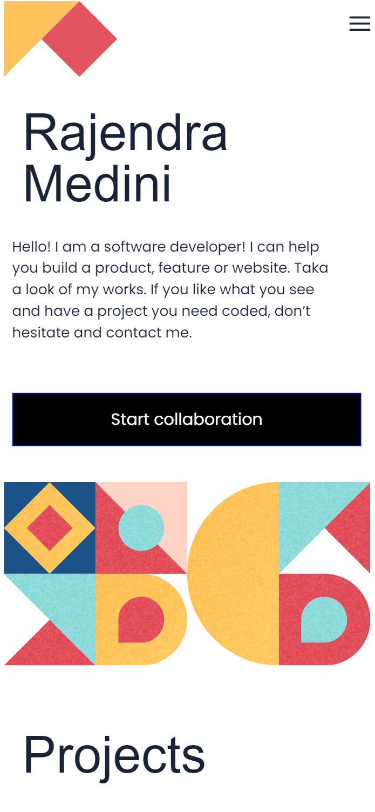

Website Development Project - 2nd Phase

The Mobile Desktop project has been deployed using GithHub Pages.

## Built With

- HTML, CSS, GitHub pages
- WebHint, StyleLint packages are used to check for linter errors
- Visual Studio

## Live Demo

[Live Demo Link](https://medini-rajendra.github.io/Phase2_webpage_project/)

## Setup 
- git clone https://github.com/Medini-Rajendra/Phase2_webpage_project.git
- cd into the folder
- git checkout design_branch
- open `index.html` with live server

## Authors
Rajendra Medini
- GitHub: [@Medini-Rajendra](https://github.com/Medini-Rajendra)
- Twitter: [@invenire512](https://twitter.com/invenire512)
- LinkedIn: [LinkedIn](https://www.linkedin.com/in/medinichaitanya/)

## 📝 License

This project is [MIT](./MIT.md) licensed.
